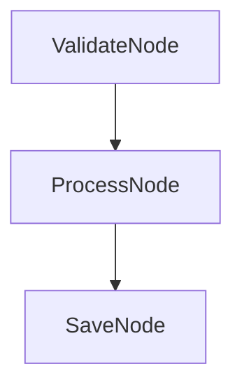

# Agora 🚀

**A Python framework for building observable AI workflows with enterprise-grade telemetry and a cloud platform for monitoring.**

[](https://www.python.org/downloads/)
[](https://opensource.org/licenses/MIT)

---

## Table of Contents

- [What is Agora?](#-what-is-agora)
- [How Agora Works](#-how-agora-works)
- [Quick Start](#-quick-start)
- [The Decorator Pattern](#-the-decorator-pattern-recommended)
- [Core Concepts](#-core-concepts)
- [Cloud Platform](#-cloud-platform)
- [Configuration](#-configuration)
- [Advanced Features](#-advanced-features)
- [Examples](#-examples)
- [API Reference](#-api-reference)

---

## 🌟 What is Agora?

Agora is a **Python framework** and **cloud platform** designed to make AI workflows **observable, debuggable, and production-ready**.

### The Problem

Building AI agent workflows is easy. Making them **reliable** and **debuggable** in production is hard:

- **Lost Context**: When workflows fail, you don't know which node failed or why
- **No Visibility**: Can't see token usage, costs, or performance bottlenecks
- **Hard to Debug**: Errors happen deep in async chains with no stack traces
- **No Monitoring**: Can't track success rates, latency, or error patterns over time

### The Solution

Agora provides:

1. **🔄 Workflow Framework**: Build multi-node workflows with conditional routing
2. **📊 Automatic Telemetry**: Every node execution is traced with OpenTelemetry
3. **🎨 Simple Decorator Pattern**: Convert functions to workflow nodes with `@agora_node`
4. **🛡️ Built-in Error Handling**: Automatic retries, fallbacks, and graceful degradation
5. **💰 Cost Tracking**: Monitor LLM token usage and estimated costs
6. **📈 Cloud Dashboard**: Real-time monitoring, analytics, and debugging UI

---

## 🧠 How Agora Works

### The Workflow Model

Agora workflows are built from **Nodes** connected by **routing logic**:

```
┌─────────────┐      ┌──────────────┐      ┌─────────────┐
│   Node A    │─────▶│   Node B     │─────▶│   Node C    │
│ (Validate)  │      │ (Process)    │      │ (Save)      │
└─────────────┘      └──────────────┘      └─────────────┘
```

Each node has three phases:

1. **Prep**: Prepare data from shared state
2. **Exec**: Execute main logic (with automatic retries)
3. **Post**: Update shared state with results

### The Shared State

All nodes share a **dictionary** (`shared`) that flows through the workflow:

```python
shared = {
    "user_id": "123",
    "input_data": "Hello",
    "processed_data": None,  # Node B will fill this
    "final_result": None     # Node C will fill this
}
```

This makes data flow **explicit** and **traceable**.

### Automatic Telemetry

Every node execution creates an **OpenTelemetry span**:

```
Workflow: "User Onboarding"
├─ ValidateUser (50ms) ✓
├─ CreateAccount (120ms) ✓
├─ SendWelcomeEmail (300ms) ✗ (retry 1/3)
└─ SendWelcomeEmail (280ms) ✓
```

These spans are:
- **Saved locally** as JSON files (`.agora/telemetry/`)
- **Uploaded to cloud** (if configured with Supabase)
- **Visualized in dashboard** with graphs and timelines

---

## 🚀 Quick Start

### Installation

```bash
# Clone the repository
git clone https://github.com/yourusername/agora.git
cd agora

# Install dependencies
pip install -e .
```

### Your First Workflow

```python
import asyncio
from agora import AsyncNode, init_agora

# Initialize telemetry
init_agora(project_name="My First Workflow")

# Define a node
class GreetingNode(AsyncNode):
    async def exec_async(self, prep_res):
        name = prep_res.get("name", "World")
        return f"Hello, {name}!"

# Run it
async def main():
    node = GreetingNode("greet")
    result = await node.run_async({"name": "Alice"})
    print(result)  # Output: Hello, Alice!

asyncio.run(main())
```

**What just happened?**

1. `init_agora()` set up telemetry tracking
2. `GreetingNode` executed and was automatically traced
3. A telemetry file was saved to `.agora/telemetry/trace-{id}.json`

---

## 🎨 The Decorator Pattern (Recommended)

The **simplest** way to build workflows is with the `@agora_node` decorator.

### Basic Decorator Usage

```python
from agora.agora_tracer import agora_node, init_agora
import asyncio

init_agora(project_name="Chatbot Demo")

@agora_node(name="GetUserInput")
async def get_user_input(shared):
    """Get input from user"""
    user_message = input("You: ")
    shared["user_message"] = user_message
    return "process_message"  # Route to next node

@agora_node(name="ProcessMessage")
async def process_message(shared):
    """Process the message"""
    message = shared.get("user_message", "")
    response = f"Echo: {message}"
    shared["bot_response"] = response
    return "display_response"

@agora_node(name="DisplayResponse")
async def display_response(shared):
    """Display the response"""
    print(f"Bot: {shared['bot_response']}")
    return "success"

# Connect nodes
get_user_input.successors = {"process_message": process_message}
process_message.successors = {"display_response": display_response}

# Run workflow
async def main():
    await get_user_input.run_async({})

asyncio.run(main())
```

### What the Decorator Does

When you use `@agora_node`, it:

1. **Wraps your function** in a `TracedAsyncNode` class
2. **Adds telemetry** tracking automatically
3. **Enables routing** via the return value
4. **Adds retry logic** (configurable)
5. **Captures errors** with full context

### Decorator Parameters

```python
@agora_node(
    name="MyNode",           # Node name (for telemetry)
    max_retries=3,           # Retry on failure (default: 1)
    wait=2,                  # Wait 2s between retries (default: 0)
    capture_io=True          # Capture print statements (default: None)
)
async def my_node(shared):
    # Your logic here
    return "next_node_key"
```

### Real Example: Chatbot with OpenAI

See [`examples/chatbot_2nodes.py`](./examples/chatbot_2nodes.py) for a complete chatbot:

```python
@agora_node(name="GetAIResponse")
async def get_ai_response(shared):
    """Call OpenAI to get response"""
    user_msg = shared.get("user_message", "")
    history = shared.get("history", [])
    
    messages = [{"role": "system", "content": "You are a helpful assistant."}]
    messages.extend(history)
    messages.append({"role": "user", "content": user_msg})
    
    response = await client.chat.completions.create(
        model="gpt-4o-mini",
        messages=messages,
        max_tokens=150
    )
    
    shared["ai_response"] = response.choices[0].message.content
    return "default"

@agora_node(name="UpdateHistory")
async def update_history(shared):
    """Update conversation history"""
    history = shared.get("history", [])
    history.append({"role": "user", "content": shared["user_message"]})
    history.append({"role": "assistant", "content": shared["ai_response"]})
    shared["history"] = history
    return "default"

# Chain them together
get_ai_response.successors = {"default": update_history}
```

**Run it:**
```bash
PYTHONPATH=. python3 examples/chatbot_2nodes.py
```

---

## 📚 Core Concepts

### 1. Nodes

**Nodes** are the building blocks of workflows. Each node performs one task.

#### Class-Based Nodes

```python
from agora import AsyncNode

class ProcessDataNode(AsyncNode):
    def __init__(self):
        super().__init__(
            name="process_data",
            max_retries=3,  # Retry 3 times on failure
            wait=1          # Wait 1 second between retries
        )
    
    async def prep_async(self, shared):
        """Prepare data from shared state"""
        return shared.get("input_data")
    
    async def exec_async(self, prep_res):
        """Main execution logic"""
        processed = prep_res.upper()
        return processed
    
    async def post_async(self, shared, prep_res, exec_res):
        """Update shared state with results"""
        shared["output"] = exec_res
        return exec_res
```

#### Node Lifecycle

```
┌──────────────────────────────────────────────────────┐
│                    Node Execution                     │
├──────────────────────────────────────────────────────┤
│                                                       │
│  1. prep_async(shared)                               │
│     ↓                                                 │
│  2. exec_async(prep_res)  ← Retries happen here      │
│     ↓                                                 │
│  3. post_async(shared, prep_res, exec_res)           │
│     ↓                                                 │
│  4. Return routing key                                │
│                                                       │
└──────────────────────────────────────────────────────┘
```

### 2. Flows

**Flows** orchestrate multiple nodes with routing logic.

```python
from agora import AsyncFlow

class DataPipeline(AsyncFlow):
    def __init__(self):
        # Create nodes
        validate = ValidateNode()
        process = ProcessNode()
        save = SaveNode()
        
        # Set up routing
        validate.successors = {"valid": process, "invalid": save}
        process.successors = {"default": save}
        
        # Initialize flow with start node
        super().__init__("Data Pipeline", start=validate)

# Run the flow
async def main():
    flow = DataPipeline()
    result = await flow.run_async({"input_data": "raw data"})

asyncio.run(main())
```

### 3. Conditional Routing

Nodes can route to different successors based on their return value:

```python
class RouterNode(AsyncNode):
    async def exec_async(self, prep_res):
        amount = prep_res.get("amount", 0)
        
        if amount > 1000:
            return "high_value"
        elif amount > 100:
            return "medium_value"
        else:
            return "low_value"

# Set up routing
router.successors = {
    "high_value": high_value_handler,
    "medium_value": medium_value_handler,
    "low_value": low_value_handler
}
```

### 4. Error Handling

Nodes automatically retry on failure and can have fallback logic:

```python
class APICallNode(AsyncNode):
    def __init__(self):
        super().__init__(
            "api_call",
            max_retries=3,  # Try 3 times
            wait=2          # Wait 2s between retries
        )
    
    async def exec_async(self, prep_res):
        # This will retry automatically on failure
        response = await external_api.call()
        return response
    
    async def exec_fallback_async(self, prep_res, exc):
        """Called if all retries fail"""
        print(f"API call failed after 3 retries: {exc}")
        return {"status": "error", "message": str(exc)}
```

### 5. Telemetry

Every node execution is automatically traced:

```python
from agora.agora_tracer import init_agora

# Initialize telemetry
init_agora(
    project_name="My Workflow",
    api_key="agora_xxx",                          # Optional: for cloud upload
    supabase_url="https://xxx.supabase.co",       # Optional: for cloud upload
    supabase_key="xxx",                           # Optional: for cloud upload
    silent_mode=False                             # Set True to suppress warnings
)
```

**What gets tracked:**

- Node name and type
- Start time and duration
- Input parameters (prep_res)
- Output results (exec_res)
- Errors and retry attempts
- Token usage (for LLM calls)
- Business context (custom attributes)

**Where telemetry is saved:**

1. **Local files**: `.agora/telemetry/trace-{id}.json`
2. **Cloud database**: Supabase (if configured)

### 6. Business Context (Wide Events)

Add custom attributes to all telemetry:

```python
from agora.wide_events import set_business_context

# Set context once
set_business_context({
    "user_id": "user_123",
    "session_id": "sess_456",
    "environment": "production",
    "feature_flag": "new_ui_v2"
})

# All subsequent telemetry will include this context
# You can filter by these attributes in the dashboard
```

---

## 📊 Cloud Platform

Agora includes a **full-stack web platform** for monitoring and managing workflows.

### Platform Features

- **🏠 Dashboard**: Overview of executions, success rates, and recent activity
- **📈 Monitoring**: Real-time workflow visualization with Cytoscape.js graphs
- **💰 Cost Analytics**: Track LLM token usage and estimated costs
- **📊 Telemetry Explorer**: Browse spans, events, and execution traces
- **🔍 Execution Detail**: Deep-dive into individual workflow runs
- **📝 Telemetry Logs**: Structured logging with search and filtering
- **🎯 Projects**: Organize workflows by project
- **🏢 Organizations**: Multi-tenant support with team management
- **⚙️ Settings**: API key management and organization settings

### Technology Stack

**Backend:**
- FastAPI (Python web framework)
- Supabase (PostgreSQL + Auth + RLS)
- OpenTelemetry (distributed tracing)

**Frontend:**
- React 19 + TypeScript
- Vite (build tool)
- TailwindCSS (styling)
- Cytoscape.js (graph visualization)
- Monaco Editor (code viewer)
- Recharts (analytics charts)

### Starting the Platform

```bash
# 1. Set up environment variables
cp .env.example .env
# Edit .env with your Supabase credentials

# 2. Start the backend
cd platform/backend
pip install -r requirements.txt
uvicorn main:app --reload

# 3. Start the frontend (in another terminal)
cd platform/frontend
npm install
npm run dev
```

**Access the dashboard:**
- Frontend: `http://localhost:5173`
- Backend API: `http://localhost:8000`
- API Docs: `http://localhost:8000/docs`

### Platform Screenshots

**Monitoring Dashboard:**
- Real-time workflow graph visualization
- Filter by workflow, date range, status
- Node-level success/failure tracking

**Cost Dashboard:**
- Token usage per workflow and node
- Estimated costs based on OpenAI pricing
- Cost trends over time

**Execution Detail:**
- Timeline visualization of node execution
- Shared state snapshots at each step
- Error stack traces and retry history

---

## 🔧 Configuration

### Environment Variables

Create a `.env` file in the root directory:

```bash
# Supabase (required for cloud platform)
VITE_SUPABASE_URL="https://your-project.supabase.co"
VITE_SUPABASE_ANON_KEY="your-supabase-anon-key-here"

# Agora API Key (generated in platform settings)
AGORA_API_KEY="your-agora-api-key-here"

# OpenAI (required for LLM nodes)
OPENAI_API_KEY="sk-proj-your-openai-key-here"

# Traceloop (optional, for advanced LLM tracing)
TRACELOOP_API_KEY="your-traceloop-key-here"

# Organization ID (auto-created on first run)
AGORA_ORG_ID="your-organization-id-here"
```

### Programmatic Configuration

```python
from agora.agora_tracer import init_agora

init_agora(
    app_name="My App",                            # Application name
    project_name="My Project",                    # Project name
    api_key="agora_xxx",                          # Agora API key
    supabase_url="https://xxx.supabase.co",       # Supabase URL
    supabase_key="xxx",                           # Supabase anon key
    sampling_rate=1.0,                            # Sample 100% of traces
    capture_io=False,                             # Capture print statements
    enable_cloud_upload=True,                     # Upload to cloud
    silent_mode=False                             # Suppress warnings
)
```

### Configuration Options

| Parameter | Type | Default | Description |
|-----------|------|---------|-------------|
| `app_name` | `str` | `"agora-app"` | Application name for telemetry |
| `project_name` | `str` | `None` | Project name (required for cloud upload) |
| `api_key` | `str` | `None` | Agora API key (from platform settings) |
| `supabase_url` | `str` | `None` | Supabase project URL |
| `supabase_key` | `str` | `None` | Supabase anon key |
| `sampling_rate` | `float` | `1.0` | Fraction of traces to sample (0.0-1.0) |
| `capture_io` | `bool` | `False` | Capture stdout/stderr in telemetry |
| `enable_cloud_upload` | `bool` | `True` | Upload telemetry to cloud |
| `silent_mode` | `bool` | `False` | Suppress initialization warnings |

---

## 🎯 Advanced Features

### LLM Integration with Token Tracking

```python
from agora.instrument_openai import trace_openai_call
from openai import OpenAI

class LLMNode(AsyncNode):
    def __init__(self):
        super().__init__("llm_call")
        self.client = OpenAI()
    
    async def exec_async(self, prep_res):
        # Automatically tracks: tokens, cost, latency
        response = trace_openai_call(
            self.client,
            model="gpt-4o-mini",
            messages=[{"role": "user", "content": prep_res["prompt"]}]
        )
        return response.choices[0].message.content
```

### Node Registry

Register and discover nodes dynamically:

```python
from agora.registry import NodeRegistry

registry = NodeRegistry()

# Register a node
@registry.register(name="custom_processor")
class CustomProcessor(AsyncNode):
    async def exec_async(self, prep_res):
        return "processed"

# Get node by name
node_class = registry.get("custom_processor")
node = node_class()
```

### Workflow Visualization

Generate Mermaid diagrams of your workflows:

```python
flow = DataPipeline()
mermaid_code = flow.to_mermaid()
print(mermaid_code)
```

Output:


---

## 📖 Examples

### Example 1: Simple Sequential Workflow

```python
from agora import AsyncNode, AsyncFlow
import asyncio

class FetchDataNode(AsyncNode):
    async def exec_async(self, prep_res):
        await asyncio.sleep(0.1)  # Simulate API call
        return {"data": [1, 2, 3, 4, 5]}

class TransformDataNode(AsyncNode):
    async def exec_async(self, prep_res):
        data = prep_res.get("data", [])
        return {"transformed": [x * 2 for x in data]}

class SaveDataNode(AsyncNode):
    async def exec_async(self, prep_res):
        print(f"Saving: {prep_res}")
        return "saved"

# Build workflow
fetch = FetchDataNode("fetch")
transform = TransformDataNode("transform")
save = SaveDataNode("save")

fetch.successors = {"default": transform}
transform.successors = {"default": save}

flow = AsyncFlow("ETL Pipeline", start=fetch)

# Run
asyncio.run(flow.run_async({}))
```

### Example 2: Conditional Routing

See [`examples/conditional_routing.py`](./examples/conditional_routing.py) for a complete example with:
- Amount-based routing (high/medium/low value)
- Different handlers for each path
- Error handling and retries

### Example 3: Chatbot with Memory

See [`examples/chatbot_2nodes.py`](./examples/chatbot_2nodes.py) for a complete chatbot with:
- OpenAI integration
- Conversation history management
- Graceful fallback (echo mode without API key)

---

## 📚 API Reference

### Core Classes

#### `AsyncNode`

Base class for asynchronous workflow nodes.

**Constructor:**
```python
AsyncNode(
    name: str,
    max_retries: int = 1,
    wait: float = 0
)
```

**Methods:**
- `prep_async(shared: Dict) -> Any`: Prepare data before execution
- `exec_async(prep_res: Any) -> Any`: Main execution logic (retried on failure)
- `post_async(shared: Dict, prep_res: Any, exec_res: Any) -> Any`: Post-processing
- `exec_fallback_async(prep_res: Any, exc: Exception) -> Any`: Fallback on all retries failed
- `run_async(shared: Dict, context: Optional[Dict] = None) -> Any`: Execute the node

**Attributes:**
- `successors: Dict[str, AsyncNode]`: Routing map (return value → next node)

#### `AsyncFlow`

Orchestrates multiple nodes with routing.

**Constructor:**
```python
AsyncFlow(
    name: str,
    start: Optional[AsyncNode] = None
)
```

**Methods:**
- `prep_async(shared: Dict) -> Any`: Flow-level preparation
- `post_async(shared: Dict, prep_res: Any, exec_res: Any) -> Any`: Flow-level post-processing
- `run_async(shared: Dict, context: Optional[Dict] = None) -> Any`: Execute the flow
- `to_dict() -> Dict`: Export flow structure as dictionary
- `to_mermaid() -> str`: Generate Mermaid diagram

#### `@agora_node` Decorator

Convert a function into a traced async node.

**Signature:**
```python
@agora_node(
    name: Optional[str] = None,
    max_retries: int = 1,
    wait: float = 0,
    capture_io: Optional[bool] = None
)
async def my_node(shared: Dict) -> str:
    # Your logic here
    return "routing_key"
```

**Parameters:**
- `name`: Node name (defaults to function name)
- `max_retries`: Number of retry attempts
- `wait`: Seconds to wait between retries
- `capture_io`: Capture stdout/stderr in telemetry

### Telemetry Functions

#### `init_agora()`

Initialize Agora with telemetry.

```python
init_agora(
    app_name: str = "agora-app",
    project_name: Optional[str] = None,
    api_key: Optional[str] = None,
    supabase_url: Optional[str] = None,
    supabase_key: Optional[str] = None,
    sampling_rate: float = 1.0,
    capture_io: bool = False,
    enable_cloud_upload: bool = True,
    silent_mode: bool = False
)
```

#### `set_business_context()`

Add business context to all telemetry.

```python
from agora.wide_events import set_business_context

set_business_context({
    "user_id": "user_123",
    "session_id": "sess_456",
    "custom_field": "value"
})
```

---

## 🤝 Contributing

Contributions are welcome! Please feel free to submit a Pull Request.

## 📄 License

MIT License - see LICENSE file for details.

## 🙏 Acknowledgments

Built with:
- [OpenTelemetry](https://opentelemetry.io/) for observability
- [Supabase](https://supabase.com/) for cloud backend
- [FastAPI](https://fastapi.tiangolo.com/) for backend API
- [React](https://react.dev/) for frontend UI

---

**Need help?** Check out the [examples](./examples/) directory or open an issue on GitHub.
